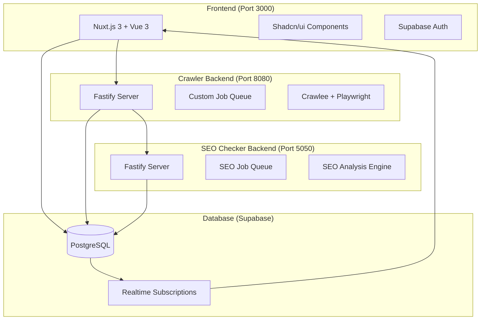
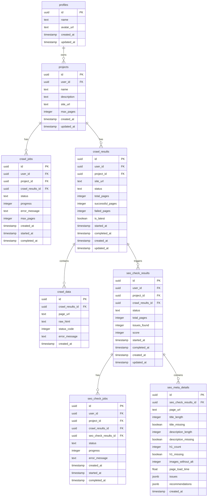

# 設計書

## 概要

サイトチェッカーは、ウェブサイトの自動クローリング、サイトマップ作成、SEO 分析機能を備えたフルスタック Web アプリケーションです。マイクロサービスアーキテクチャを採用し、フロントエンド、クローラーバックエンド、SEO チェッカーバックエンドの 3 つの主要コンポーネントで構成されています。

## アーキテクチャ

### システム全体構成



### データフロー

1. **プロジェクト作成**: ユーザーがフロントエンドでプロジェクトを作成
2. **クローリングジョブ発行**: `crawl_jobs`テーブルにジョブを作成し、`crawl_results`にレコード作成
3. **クローリング実行**: Crawlee エンジンがサイトをクローリングし、`crawl_data`にデータ保存
4. **クローリング完了**: `crawl_results`のステータスを`completed`に更新
5. **Webhook 通知**: SEO チェッカーバックエンドに完了通知を送信
6. **SEO 分析ジョブ発行**: `seo_check_results`にレコード作成し、`seo_check_jobs`にジョブ発行
7. **SEO 分析実行**: SEO 分析エンジンが`seo_meta_details`にページごとの詳細結果を保存
8. **SEO 分析完了**: `seo_check_results`のステータスを`completed`に更新

## コンポーネントと インターフェース

### フロントエンド (Nuxt.js 3)

#### 技術スタック

- **フレームワーク**: Nuxt.js 3 + Vue 3 + TypeScript
- **UI ライブラリ**: Shadcn/ui + Tailwind CSS v4
- **状態管理**: Pinia
- **認証**: Supabase Auth (Google OAuth)
- **可視化**: Vue Flow
- **フォーム**: Vee-validate + Zod

#### 主要ページ

- `/` - ランディングページ
- `/login` - 認証ページ
- `/projects` - プロジェクト一覧
- `/projects/new` - プロジェクト作成（多段階フォーム）
- `/projects/[id]/details` - プロジェクト詳細・可視化

#### コンポーネント構成

```
components/
├── ui/                    # Shadcn/ui基本コンポーネント
├── layout/               # レイアウトコンポーネント
├── project/              # プロジェクト関連コンポーネント
│   ├── ProjectOverview.vue
│   ├── ProjectQuality.vue
│   └── ProjectSettings.vue
├── PageTitle.vue         # ページタイトル
├── SpecialNode.vue       # Vue Flow用ノード
└── SpecialEdge.vue       # Vue Flow用エッジ
```

### クローラーバックエンド (Node.js + Fastify)

#### 技術スタック

- **フレームワーク**: Fastify
- **クローラーエンジン**: Crawlee + Playwright
- **ジョブキュー**: Supabase ベースカスタム実装
- **データベース**: Supabase Client

#### API エンドポイント

```typescript
interface CrawlerAPI {
  "POST /create-crawl-data": {
    body: {
      projectId: string;
      siteUrl: string;
      maxPages: number;
    };
    response: {
      jobId: string;
      status: "queued" | "running" | "completed" | "failed";
    };
  };

  "GET /health": {
    response: { status: "ok" };
  };
}
```

#### ジョブキュー設計

```typescript
class SupabaseQueue {
  private maxConcurrentJobs = 1;
  private eventEmitter = new EventEmitter();

  async addJob(jobData: CrawlJobData): Promise<string>;
  async processJobs(): Promise<void>;
  private async executeCrawl(job: CrawlJob): Promise<void>;
}
```

#### ストレージ構成

```
storage/
├── datasets/             # 個別ページデータ（JSON）
├── request_queues/       # リクエスト管理
├── key_value_stores/     # クローラー統計
├── merged-crawl-data.json # 統合結果
└── vueflow-data.json     # 可視化データ
```

### SEO チェッカーバックエンド (Node.js + Fastify)

#### 技術スタック

- **フレームワーク**: Fastify
- **HTML 解析**: Cheerio
- **ジョブキュー**: Supabase ベースカスタム実装

#### API エンドポイント

```typescript
interface SEOCheckerAPI {
  "POST /completed-crawler": {
    body: {
      crawlResultsId: string;
      projectId: string;
      userId: string;
    };
    response: {
      seoJobId: string;
      status: "queued" | "running" | "completed" | "failed";
    };
  };

  "GET /health": {
    response: { status: "ok" };
  };
}
```

#### SEO 分析エンジン

```typescript
interface SEOAnalysis {
  checkMetaTags(html: string): MetaTagResults;
  checkHeadingStructure(html: string): HeadingResults;
  checkImageAltAttributes(html: string): ImageResults;
  checkPageSpeed(url: string): PerformanceResults;
  generateRecommendations(results: SEOResults): Recommendation[];
}
```

## データモデル

### データベーススキーマ

```sql
-- プロジェクト管理
CREATE TABLE projects (
  id UUID PRIMARY KEY DEFAULT gen_random_uuid(),
  user_id UUID REFERENCES auth.users(id),
  name TEXT NOT NULL,
  description TEXT,
  site_url TEXT NOT NULL,
  max_pages INTEGER DEFAULT 20,
  created_at TIMESTAMP WITH TIME ZONE DEFAULT NOW(),
  updated_at TIMESTAMP WITH TIME ZONE DEFAULT NOW()
);

-- クローリングジョブ管理
CREATE TABLE crawl_jobs (
  id UUID PRIMARY KEY DEFAULT gen_random_uuid(),
  user_id UUID REFERENCES auth.users(id),
  project_id UUID REFERENCES projects(id),
  crawl_results_id UUID REFERENCES crawl_results(id),
  status TEXT DEFAULT 'queued' CHECK (status IN ('queued', 'running', 'completed', 'failed')),
  progress INTEGER DEFAULT 0,
  error_message TEXT,
  max_pages INTEGER DEFAULT 20,
  created_at TIMESTAMP WITH TIME ZONE DEFAULT NOW(),
  started_at TIMESTAMP WITH TIME ZONE,
  completed_at TIMESTAMP WITH TIME ZONE
);

-- クローリング結果
CREATE TABLE crawl_results (
  id UUID PRIMARY KEY DEFAULT gen_random_uuid(),
  user_id UUID REFERENCES auth.users(id),
  project_id UUID REFERENCES projects(id),
  site_url TEXT NOT NULL,
  status TEXT DEFAULT 'running' CHECK (status IN ('running', 'completed', 'failed')),
  total_pages INTEGER DEFAULT 0,
  successful_pages INTEGER DEFAULT 0,
  failed_pages INTEGER DEFAULT 0,
  is_latest BOOLEAN DEFAULT true,
  started_at TIMESTAMP WITH TIME ZONE DEFAULT NOW(),
  completed_at TIMESTAMP WITH TIME ZONE,
  created_at TIMESTAMP WITH TIME ZONE DEFAULT NOW(),
  updated_at TIMESTAMP WITH TIME ZONE DEFAULT NOW()
);

-- 個別ページデータ
CREATE TABLE crawl_data (
  id UUID PRIMARY KEY DEFAULT gen_random_uuid(),
  crawl_results_id UUID REFERENCES crawl_results(id),
  page_url TEXT NOT NULL,
  raw_html TEXT,
  status_code INTEGER,
  error_message TEXT,
  created_at TIMESTAMP WITH TIME ZONE DEFAULT NOW()
);

-- SEOチェック結果
CREATE TABLE seo_check_results (
  id UUID PRIMARY KEY DEFAULT gen_random_uuid(),
  user_id UUID REFERENCES auth.users(id),
  project_id UUID REFERENCES projects(id),
  crawl_results_id UUID REFERENCES crawl_results(id),
  status TEXT DEFAULT 'running' CHECK (status IN ('running', 'completed', 'failed')),
  total_pages INTEGER DEFAULT 0,
  issues_found INTEGER DEFAULT 0,
  score INTEGER,
  started_at TIMESTAMP WITH TIME ZONE DEFAULT NOW(),
  completed_at TIMESTAMP WITH TIME ZONE,
  created_at TIMESTAMP WITH TIME ZONE DEFAULT NOW(),
  updated_at TIMESTAMP WITH TIME ZONE DEFAULT NOW()
);

-- SEOチェックジョブ
CREATE TABLE seo_check_jobs (
  id UUID PRIMARY KEY DEFAULT gen_random_uuid(),
  user_id UUID REFERENCES auth.users(id),
  project_id UUID REFERENCES projects(id),
  crawl_results_id UUID REFERENCES crawl_results(id),
  seo_check_results_id UUID REFERENCES seo_check_results(id),
  status TEXT DEFAULT 'queued' CHECK (status IN ('queued', 'running', 'completed', 'failed')),
  progress INTEGER DEFAULT 0,
  error_message TEXT,
  created_at TIMESTAMP WITH TIME ZONE DEFAULT NOW(),
  started_at TIMESTAMP WITH TIME ZONE,
  completed_at TIMESTAMP WITH TIME ZONE
);

-- SEO詳細結果（ページごと）
CREATE TABLE seo_meta_details (
  id UUID PRIMARY KEY DEFAULT gen_random_uuid(),
  seo_check_results_id UUID REFERENCES seo_check_results(id),
  page_url TEXT NOT NULL,
  title_length INTEGER,
  title_missing BOOLEAN DEFAULT false,
  description_length INTEGER,
  description_missing BOOLEAN DEFAULT false,
  h1_count INTEGER DEFAULT 0,
  h1_missing BOOLEAN DEFAULT false,
  images_without_alt INTEGER DEFAULT 0,
  page_load_time FLOAT,
  issues JSONB,
  recommendations JSONB,
  created_at TIMESTAMP WITH TIME ZONE DEFAULT NOW()
);

-- ユーザープロファイル
CREATE TABLE profiles (
  id UUID PRIMARY KEY REFERENCES auth.users(id),
  name TEXT,
  avatar_url TEXT,
  created_at TIMESTAMP WITH TIME ZONE DEFAULT NOW(),
  updated_at TIMESTAMP WITH TIME ZONE DEFAULT NOW()
);
```

### データ関係図



## エラーハンドリング

### クローラーエラー処理

- **ネットワークエラー**: 指数バックオフによるリトライ（最大 3 回）
- **レート制限**: 自動的な遅延とリクエスト調整
- **無効な URL**: エラーログ記録と次の URL へ継続
- **タイムアウト**: 30 秒でタイムアウト、エラーとして記録

### SEO 分析エラー処理

- **HTML 解析エラー**: 部分的な分析結果を保存
- **データベースエラー**: トランザクションロールバック
- **外部 API 呼び出しエラー**: フォールバック値の使用

### フロントエンドエラー処理

- **認証エラー**: 自動ログインページリダイレクト
- **ネットワークエラー**: ユーザーフレンドリーなエラーメッセージ
- **バリデーションエラー**: リアルタイムフォーム検証

## 検索・エクスポート機能

### 全文検索機能

#### 検索対象データ

- **ページコンテンツ**: `crawl_data.raw_html`から抽出されたテキスト
- **メタデータ**: タイトル、説明文、見出しタグ
- **URL**: ページ URL 部分一致検索

#### 検索機能設計

```typescript
interface SearchAPI {
  "POST /search": {
    body: {
      projectId: string;
      query: string;
      searchType: "text" | "regex";
      filters?: {
        pageUrl?: string;
        statusCode?: number;
        dateRange?: { from: Date; to: Date };
      };
    };
    response: {
      results: SearchResult[];
      totalCount: number;
      page: number;
      pageSize: number;
    };
  };
}

interface SearchResult {
  pageUrl: string;
  title: string;
  snippet: string;
  highlights: string[];
  statusCode: number;
  crawledAt: Date;
}
```

#### PostgreSQL 全文検索実装

```sql
-- 全文検索用のインデックス作成
CREATE INDEX idx_crawl_data_fulltext
ON crawl_data USING gin(to_tsvector('japanese', raw_html));

-- 検索クエリ例
SELECT cd.page_url, cd.raw_html, ts_headline('japanese', cd.raw_html, query) as snippet
FROM crawl_data cd
WHERE cd.crawl_results_id = $1
  AND to_tsvector('japanese', cd.raw_html) @@ plainto_tsquery('japanese', $2);
```

### エクスポート機能

#### XML サイトマップ生成

```typescript
interface SitemapGenerator {
  generateXMLSitemap(crawlResultsId: string): Promise<string>;
  generateHTMLSitemap(crawlResultsId: string): Promise<string>;
  generateSEOReport(seoCheckResultsId: string): Promise<Buffer>; // PDF
}
```

#### エクスポート API

```typescript
interface ExportAPI {
  "GET /export/sitemap.xml": {
    query: { projectId: string };
    response: string; // XML content
  };

  "GET /export/sitemap.html": {
    query: { projectId: string };
    response: string; // HTML content
  };

  "GET /export/seo-report.pdf": {
    query: { projectId: string };
    response: Buffer; // PDF file
  };
}
```

## Webhook 統合

### Webhook 設定管理

```sql
-- Webhook設定テーブル
CREATE TABLE webhook_configs (
  id UUID PRIMARY KEY DEFAULT gen_random_uuid(),
  user_id UUID REFERENCES auth.users(id),
  project_id UUID REFERENCES projects(id),
  endpoint_url TEXT NOT NULL,
  events TEXT[] DEFAULT ARRAY['crawl_completed', 'seo_completed'],
  is_active BOOLEAN DEFAULT true,
  secret_key TEXT,
  created_at TIMESTAMP WITH TIME ZONE DEFAULT NOW(),
  updated_at TIMESTAMP WITH TIME ZONE DEFAULT NOW()
);
```

### Webhook 配信システム

```typescript
interface WebhookService {
  sendWebhook(config: WebhookConfig, event: WebhookEvent): Promise<void>;
  retryFailedWebhooks(): Promise<void>;
  validateWebhookEndpoint(url: string): Promise<boolean>;
}

interface WebhookEvent {
  type: "crawl_completed" | "seo_completed";
  projectId: string;
  data: {
    crawlResultsId?: string;
    seoCheckResultsId?: string;
    status: string;
    completedAt: Date;
    summary: {
      totalPages: number;
      successfulPages: number;
      failedPages: number;
      issues?: number;
      score?: number;
    };
  };
}
```

## テスト戦略

### 単体テスト

- **フロントエンド**: Vue Test Utils + Vitest
- **バックエンド**: Jest + Supertest
- **データベース**: Supabase Test Client

### 統合テスト

- **API 統合**: Postman/Newman
- **データベース統合**: Supabase Migration Tests
- **Webhook 統合**: ngrok + テストサーバー

### E2E テスト

- **ユーザーフロー**: Playwright
- **クローリングフロー**: 専用テストサイト
- **リアルタイム機能**: WebSocket 接続テスト

### パフォーマンステスト

- **クローラー負荷**: 大規模サイトでのテスト
- **データベース負荷**: 大量データでのクエリ性能
- **フロントエンド**: Lighthouse CI

## セキュリティ考慮事項

### 認証・認可

- **OAuth 2.0**: Google OAuth による安全な認証
- **JWT**: Supabase JWT トークンによるセッション管理
- **RLS**: Row Level Security によるデータアクセス制御

### データ保護

- **暗号化**: データベース保存時の暗号化
- **HTTPS**: 全通信の TLS 暗号化
- **入力検証**: XSS/SQL インジェクション対策

### クローリング倫理

- **robots.txt 遵守**: サイトポリシーの尊重
- **レート制限**: サーバー負荷軽減
- **User-Agent**: 適切なクローラー識別

## 運用・監視

### ログ管理

- **構造化ログ**: JSON 形式でのログ出力
- **ログレベル**: ERROR, WARN, INFO, DEBUG
- **ログローテーション**: 日次ローテーション

### 監視・アラート

- **ヘルスチェック**: 各サービスの生存監視
- **メトリクス**: クローリング成功率、処理時間
- **アラート**: エラー率閾値超過時の通知

### バックアップ・復旧

- **データベース**: Supabase 自動バックアップ
- **ファイルストレージ**: 定期的なストレージバックアップ
- **災害復旧**: RTO/RPO 定義と復旧手順

## スケーラビリティ

### 水平スケーリング

- **ステートレス設計**: セッション状態の外部化
- **ロードバランサー**: 複数インスタンス対応
- **データベース**: Supabase の自動スケーリング

### 垂直スケーリング

- **リソース監視**: CPU/メモリ使用率監視
- **自動スケーリング**: クラウド環境での自動調整
- **キャッシュ戦略**: Redis/Memcached の活用

### データ分割

- **テーブル分割**: 大量データのパーティショニング
- **読み取り専用レプリカ**: 読み取り負荷分散
- **CDN**: 静的コンテンツの配信最適化
